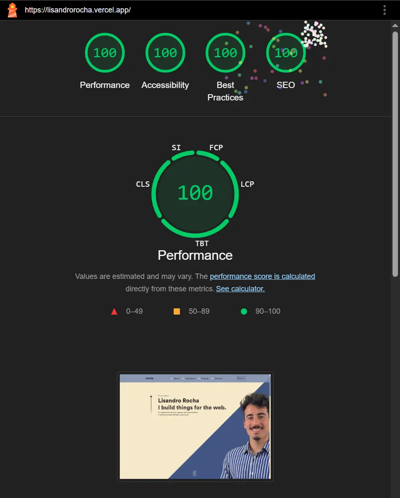
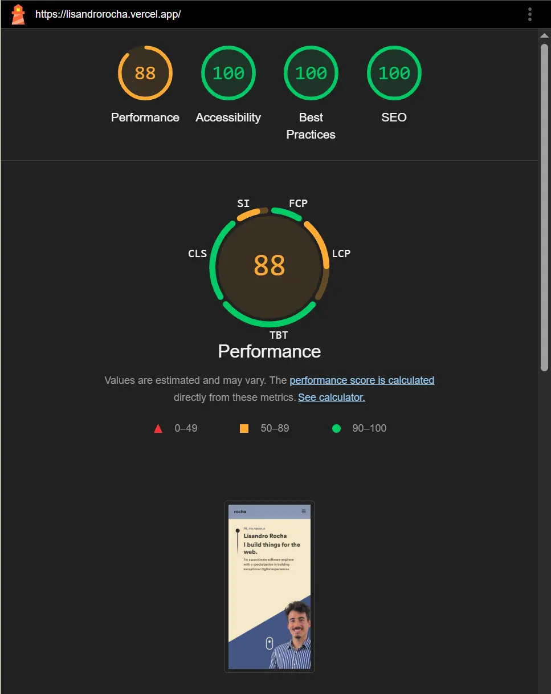

# Personal Portfolio · 

## 🎯 About

Welcome to my portfolio repo!

This project is a digital representation of my background, skills and featured projects. Here you will find information about me, my education, work experience and projects I have developed. My goal is to provide a comprehensive view of my profile and highlight the technologies I use.

Feel free to inspect the code and see how I made it possible! 😊

## 🧠 Features

- Personalized Presentation: Discover who I am and what my professional goals are.
- Education and Experience: Learn about my academic background and work experience.
- Featured Projects: Explore some of the projects I have worked on, with details about technologies used.
- Web Animations: Animations made in pure CSS or using Framer Motion, to give more life and dynamism to the web.
- Responsive Web: Created with the purpose that it can be visualized in most of the possible devices.

## :rocket: Technologies used

- [React](https://react.dev/)
- [Next.js 14](https://nextjs.org/)
- [Tailwind CSS](https://tailwindcss.com/)
- [Font Awesome](https://fontawesome.com/)
- [Framer Motion](https://www.framer.com/motion/)
- [Typescript](https://www.typescriptlang.org/)
- [Vercel](https://vercel.com/)

## 📷 Lighthouse Screenshots

